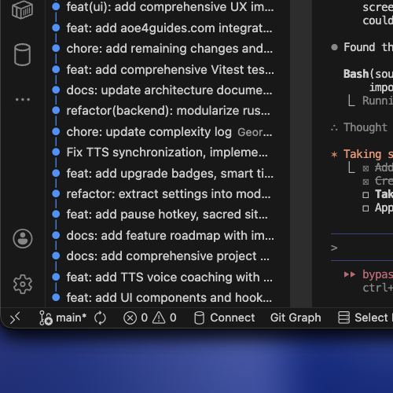

<div align="center">

# AoE4 Overlay

### Your Build Order Coach for Age of Empires IV

[](https://github.com/georgepwall1991/AOEOverlay/releases)
[](LICENSE)
[]()
[](https://tauri.app)

**A lightweight, cross-platform overlay that displays build orders while you play.**

Import from [aoe4world.com](https://aoe4world.com) or [aoe4guides.com](https://aoe4guides.com), navigate with hotkeys, and get voice coaching to improve your game.

[**Download**](#-installation) · [**Features**](#-features) · [**Usage**](#-usage) · [**Contributing**](#-contributing)

---

<!-- Add a screenshot here -->
<!--  -->

</div>

## Why AoE4 Overlay?

- **Zero alt-tabbing** — Build orders stay visible on top of your game
- **Voice coaching** — Steps are read aloud so you never miss a beat
- **Import in seconds** — Paste any URL from aoe4world.com or aoe4guides.com
- **Tiny footprint** — ~4MB app, minimal CPU/memory usage
- **Works offline** — No account or internet required to use

---

## Installation

### Download

| Platform | Download |
|:--------:|:--------:|
| **Windows** | [`.msi` installer](https://github.com/georgepwall1991/AOEOverlay/releases/latest) |
| **macOS (Apple Silicon)** | [`.dmg` installer](https://github.com/georgepwall1991/AOEOverlay/releases/latest) |
| **macOS (Intel)** | [`.dmg` installer](https://github.com/georgepwall1991/AOEOverlay/releases/latest) |
| **Linux** | [`.AppImage`](https://github.com/georgepwall1991/AOEOverlay/releases/latest) / [`.deb`](https://github.com/georgepwall1991/AOEOverlay/releases/latest) |

> **Note:** Apps are unsigned. On macOS, right-click and select "Open" the first time. On Windows, click "More info" → "Run anyway".

---

## Features

### Build Order Display

| Feature | Description |
|---------|-------------|
| **Always-on-top** | Transparent overlay stays visible during gameplay |
| **Step navigation** | See current, previous, and upcoming steps at a glance |
| **Resource tracking** | Food, wood, gold, stone counts per step |
| **Civilization badges** | Visual civ indicators with official game icons |
| **Two view modes** | Expanded (detailed) or Compact (minimal) |
| **Click-through** | Overlay doesn't block mouse clicks on your game |

### Voice Coaching

- **Text-to-speech** reads each step aloud as you advance
- **Adjustable speed** from 0.5x to 2.0x
- **Smart icon parsing** — `[icon:scout]` is spoken as "scout"
- **Platform native** — Uses macOS `say` and Windows SAPI

### Timer & Pace Tracking

- Tracks elapsed game time from your first step
- Shows **delta** (ahead/behind) vs expected timing
- Visual progress bar with pace indicator

### Import From Popular Sites

```
https://aoe4world.com/builds/12345
https://aoe4guides.com/build/abc123
```

Just paste the URL and the build is imported automatically.

### Global Hotkeys

| Key | Action |
|:---:|--------|
| `Ctrl+Alt+F1` | Toggle overlay visibility |
| `Ctrl+Alt+F2` | Previous step |
| `Ctrl+Alt+F3` | Next step |
| `Ctrl+Alt+F4` | Cycle between build orders |
| `Ctrl+Alt+F5` | Toggle click-through mode |
| `Ctrl+Alt+F6` | Toggle compact mode |
| `Ctrl+Alt+F7` | Reset to step 1 |
| `Ctrl+Alt+F8` | Start/pause timer |
| `?` | Show keyboard shortcuts |

All hotkeys work while AoE4 has focus. Fully customizable in Settings.

### Periodic Reminders

Voice reminders to keep you on track:

| Reminder | Default Interval |
|----------|:----------------:|
| Queue villagers | 25s |
| Check your scout | 45s |
| Don't get supply blocked | 40s |
| Build more military | 60s |
| Control the map | 90s |

---

## Usage

1. **Launch the app** — Overlay appears in the corner of your screen
2. **Import a build** — Settings → paste URL from aoe4world or aoe4guides
3. **Start your game** — Overlay stays on top of AoE4
4. **Navigate with hotkeys** — Press `Ctrl+Alt+F3` to advance steps as you play
5. **Listen to coaching** — Steps are read aloud automatically

### Quick Tips

- Press `?` anytime to see all keyboard shortcuts
- Click the build name to switch between multiple builds
- Drag the grip icon to reposition the overlay
- Toggle icons in the header for voice, click-through, and compact mode

---

## Supported Civilizations

<details>
<summary><strong>All 20 civilizations supported</strong></summary>

**Base Game:**
English, French, Holy Roman Empire, Rus, Chinese, Delhi Sultanate, Abbasid Dynasty, Mongols

**The Sultans Ascend:**
Ottomans, Malians, Byzantines, Japanese

**Variant Civilizations:**
Jeanne d'Arc, Ayyubids, Zhu Xi's Legacy, Order of the Dragon

**Dynasties of the East:**
Golden Horde, Macedonian Dynasty, Sengoku Daimyo, Tughlaq Dynasty

</details>

---

## Development

### Prerequisites

- [Node.js](https://nodejs.org/) v20+
- [Rust](https://rustup.rs/) (latest stable)
- Platform dependencies:
  - **macOS**: Xcode Command Line Tools
  - **Windows**: Visual Studio C++ Build Tools
  - **Linux**: `webkit2gtk`, `libappindicator3`

### Quick Start

```bash
# Clone
git clone https://github.com/georgepwall1991/AOEOverlay.git
cd AOEOverlay

# Install dependencies
npm install

# Run in dev mode
npm run tauri dev

# Build for production
npm run tauri build
```

### Tech Stack

| Layer | Technology |
|-------|------------|
| Runtime | Tauri v2 |
| Frontend | React 19, TypeScript |
| Styling | Tailwind CSS, shadcn/ui |
| State | Zustand |
| Build | Vite |
| Backend | Rust |

### Project Structure

```
src/                    # React frontend
├── components/
│   ├── overlay/        # Overlay window
│   ├── settings/       # Settings window
│   └── ui/             # shadcn/ui components
├── hooks/              # Custom React hooks
├── stores/             # Zustand state
├── lib/                # Utilities & API clients
└── types/              # TypeScript types

src-tauri/              # Rust backend
└── src/
    ├── commands.rs     # Tauri commands
    ├── config.rs       # File I/O
    ├── hotkeys.rs      # Global shortcuts
    └── tts.rs          # Text-to-speech
```

---

## Contributing

Contributions are welcome! Please:

1. Fork the repository
2. Create a feature branch (`git checkout -b feature/amazing-feature`)
3. Commit your changes (`git commit -m 'feat: add amazing feature'`)
4. Push to the branch (`git push origin feature/amazing-feature`)
5. Open a Pull Request

---

## Acknowledgments

- Inspired by [FluffyMaguro's AoE4_Overlay](https://github.com/FluffyMaguro/AoE4_Overlay)
- Build data from [AoE4 World](https://aoe4world.com) and [AoE4 Guides](https://aoe4guides.com)
- Game icons from Age of Empires IV

---

<div align="center">

**[Download Latest Release](https://github.com/georgepwall1991/AOEOverlay/releases/latest)**

Made with love for the AoE4 community

</div>
